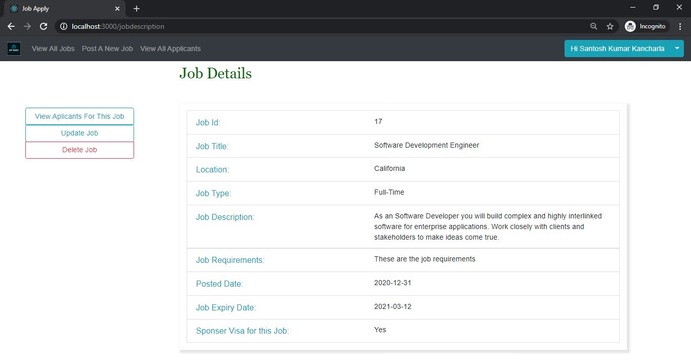

# Job Apply

## Technologies Used

1. React.js
2. PHP
3. MySQL

## Steps to setup:

1. Install `node` with this link https://nodejs.org/en/
2. Create a new react project using `create-react-app`. Instructions here https://github.com/facebook/create-react-app
3. Replace the `src` folder with the one available in my GitHub
4. Go to the project directory using command prompt and enter `npm start` in command prompt/terminal
5. The above step will open your browser and you can access it in your localhost:3000
6. Now you can see the project in your browser. But there will be no data
7. Install `MAMP` with this link https://www.mamp.info/en/downloads/
8. Go to your C drive, htdocs and create a folder by the name `JobApply`
9. Copy the files from `PHP` folder into the `JobApply` folder
10. You can now interact live with the data from the backend.

## ScreenShots

### Login

### SignUp

### Profile

### Home Page

### Track Applications

### Saved Applications

### Recruiter Home

### Post NewJob

### Job Details

### View Applicants

### Applicant Profile

## Future Work

1. Update the profile to store more information.
2. Make changes to cater to specific company needs.
3. Update UI for more convenient use.
4. Use React Hooks.
5. Host this on a real server and talk to companies to use the platform and release into market.

